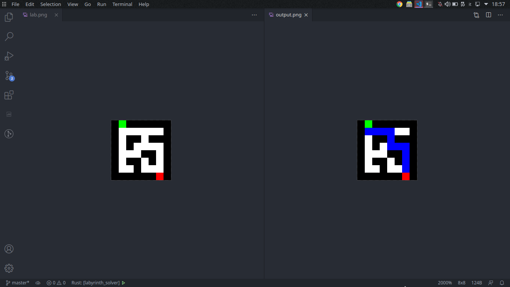
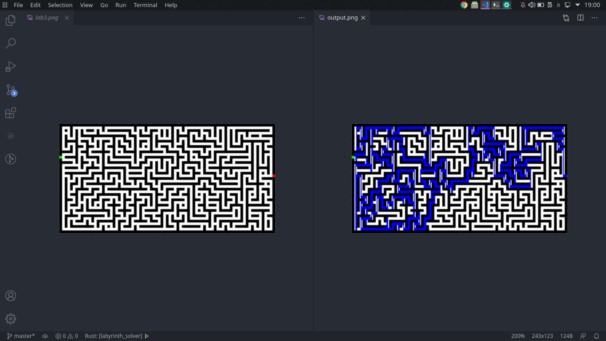

# labyrinth_solver
## Overview
Given an image with a maze inside, this program finds a path that starts from
the green block and finishes on the red block, passing on the white pixels.
Since it uses the Depth-First-Search algorithm, the output probably won't be the
shortest possible path.




## Input rules
The input should be an RGB8 image, containing at least one green pixel and one red pixel,
being the beginning and the end of the maze; all the black pixels are treated as "walls"
and the "free" spaces where you can move should not be blue (no error is given, but there
would be conflict between the original maze's color and the output's trail).

Little side note: since the pathway is created from each pixel, big images will load
slowly, due to the great amount of data.

## Algorithm overview
- First of all, the image is opened and it's data is extracted in a one-dimensional
array, in which there are the rgb bytes (they are not grouped in tuples or structs);
- Then, those bytes are grouped three by three in structs called "Nodes";
- Each node has coordinates, a color and an array of coordinate of all the nodes that
are connected with it;
- All black pixels are removed from the array of nodes (since they are not needed for
the pathfinding algorithm);
- The starting and finishing pixels are found;
- Then, all the "useless" pixels are removed;

```
A "useless" node is defined as a node on which there are only
two links placed in a straight line.

--------|   |
| A===B===C |     - Here node A is on a corner, B is in a "corridor", C is on
|  |----|   |       a "crossroad". It's inefficient to have A connected to B
                    and B connected to C, because on B there is no choice; it
                    is more efficient to connect directly A whith C (and,
                    technically, viceversa);
--------|   |
| A=======C |
|  |----|   |

All the nodes that have only 2 links put in a straight line are found.
Then the previous node (relative to the current) receives a link to
the next (relative to the current) and this next node (relative to the
current) receives a lint to the previous. This way, the middle node,
the one in the corridor, is excluded from the list of usable nodes.
```

- All the usable nodes are then put in a hashmap (key=coords
of the node; value=array of all the nodes linked to the key
pixel);
- Then, the DFS algorithm begins, taking the starting pixel,
finding it inside the hashmap and recursively applying the
function to each element of the array of links;

```
That's why a hashmap is used: since each operation is O(1) it
is significantly faster than using an array of nodes and
iterating through it
```

- The path is stored inside a stack (created from a vector);
- In order to draw on the output file, a function calculates,
having the path array, all the pixels that must be drawn;
- Finally, the output file is created;

## Necessary Note
Although the idea of removing the useless nodes is quite interestin, it is proven sperimentally
that this process is less efficient than directly executing DFS through all the
pixels, "raw". This "optimization" is 15 times SLOWER than doing DFS through every pixel.
